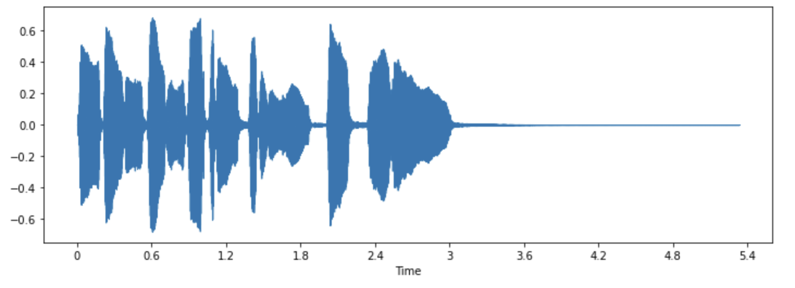
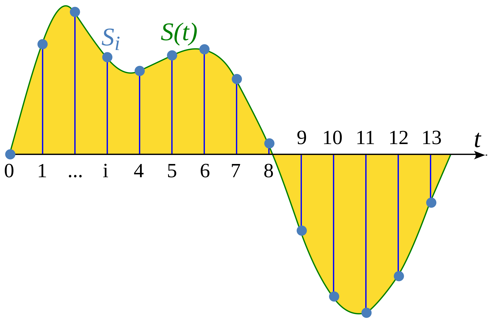

## 🚗 車禍撞擊聲音辨識 (Car Crash Sound Detection)
### 1. 專案簡介
本專案目標是利用深度學習模型以及機器學習模型，從環境聲音中辨識車禍撞擊事件。  
    * 模型輸入為 Mel-spectrogram 或 MFCC 特徵，輸出為是否發生車禍聲音的判斷。

### 2. 潛在應用場景

* 自駕車駕駛輔助系統  
    * 透過麥克風與模型，偵測周圍是否有異常撞擊聲。  
    * 例：事故發生後及時通報給家人或警消。

### 3. 音訊處理基礎知識地圖  [[hugging face refence]](https://huggingface.co/learn/audio-course/chapter1/audio_data)
* 數位音訊的本質  
    聲音是一種`連續訊號`，但為了方便儲存與使用，會以`數位`的方式儲存。  
    平常所聽見的聲音是透過空氣壓力的變化所產生。
    * Waveform（波形，Time domain）：聲壓隨時間變化的數位表示。
    
    * Sample（取樣值）：特定時間點的聲音強度。
    
    * Sample Rate or Sample Frequency（取樣率）：每秒取樣次數 (sample/per second = Hz)。
        * Nyquist Frequency = $\frac{sample \ rate}{2}$  
        音訊資料裡面最大可表示頻率為 `Nyquist Frequency`，依此設定採樣率。
            * Higher $\text{Nyquist Frequency} * 2$ 不會取得更多資訊，但增加計算複雜度
            * lower $\text{Nyquist Frequency} * 2$ 造成資料損失 (一些高頻的聲音會強制被 slient)。
                * Aliasing（混疊）：取樣率不足導致高頻錯誤映射成低頻。
    * Amplitude (震幅)：表達聲壓能量程度 (dB)，越大代表越大聲。
    * Bit Depth（位元深度）：每個取樣的精度，bit 數越高越能接近越真實的聲音幅度（例：16-bit、24-bit）。

* 頻率與時間領域
    * Frequency spectrum  
    透過傅立葉轉換求得頻率訊號。  
    頻率軸由 $F[k] = \frac{k * F_s}{N_{fft}}$，$F_s$：取樣頻率，$N_{FFT}$：計算 FFT 時的總樣本。  
    經過 FFT，會得到虛數 $a+bi$，其絕對值為振福，也能透過`棣美弗公式`看出相位角。
        * Amplitude spectrum：以震幅為 y 軸。
        * power spectrum：以震幅平方為 y 軸。
    * spectrogram
    將音訊切成許多小段，計算頻譜，根據時間軸推疊許多頻譜圖。
    * MEL-spectrogram
    跟 `spectrogram` 類似，但用不同頻率軸。  
    `spectrogram` 採用 `linear-based frequency`，但是 `MEL-spectrogram` 將頻率對應到近似人耳可感知的範圍。

* MFCC [[ref]](https://haythamfayek.com/2016/04/21/speech-processing-for-machine-learning.html)
    * pre-emphasis： a way of normalized；目的在增強高頻成分
    * framing：整段 FFT 看不到時間上的瞬間變化；STFT 假設短時間內訊號平穩，對每一小段做 FFT，再把結果接起來，就能同時看到時間與頻率的變化，也就是聲音的輪廓。
    * window： 避免 `spectrum leakage` (因為 FFT 假設是週期性訊號，但真實訊號卻是非連續，因此使結果分散到其他頻率點)，套用 window function 有效減少 `spectrum leakage`。
    * FFT and power spectrum
    * Filter Bank：mimic the non-linear human ear perception of sound
    * MFCC：因為 filter bank 所得到的特徵有緊密關聯，因此用 `Discrete Cosine Transform (DCT)` 壓縮成較少且不關聯的新特徵 (decorrelation)。

* 傅立葉轉換 (FFT、DFT、STFT)
    * Frame (幀)：蒐集某個時間點內的樣本
    * hop_len：兩組 FFT window 的差距
    * n_fft：計算頻率軸時用到，影響 frequency bin
    * n_mel：mel-frequency filter

### 4. 實驗步驟
1. 資料集準備  
* 收集聲音類別：  
    * 正：明確撞擊或強烈急煞（含前後 1–2 秒）。
    * 負：車內/外行駛聲、引擎聲（汽車/機車) 等。
    * 來源為 youtube 影片
* 對資料集進行切片（固定片段長度，如 10 秒），保證輸入維度一致。  
E.g: 在 real-time system 當中，應該也是記錄一小段就判斷。
* 資料增強：
    * Audio Data Augmentation (基於原始音訊做 SNR noise addition [[ref]](https://medium.com/analytics-vidhya/adding-noise-to-audio-clips-5d8cee24ccb8)）
2. 特徵提取
    * Mel-spectrogram
    * MFCC
3. 實驗變因設計
    * 特徵類型對分類結果的影響（MFCC vs Mel-spectrogram）
    * 資料增強策略的影響（無增強 vs oversampling vs audio augmentation）
    * t-sne 降維訓練結果比較
        * `t-sne`：利用 t-distribution 的方法讓原始資料跟降維資料的分布是接近的
    * imbalanced weight 比較
    * 各模型準確率、推論速度比較表格
    > * 可選：  
        Activation（ReLU vs LeakyReLU）。  
        Optimizer 對 DL 模型訓練的影響
4. 效能評估與統計
    * 資料切分：以「影片為單位」做 train/val/test（避免資料洩漏）。

    > 交叉驗證：可用 GroupKFold（group= Each different video），在小資料時更穩定。 [[ref]](https://www.linkedin.com/pulse/why-group-k-fold-cross-validation-pubudu-indrasiri-tpv8e/)
        > * k-fold cross validation：將資料集切割多份，拿取其中一份當驗證集，其他當訓練集。
        > * 在資料收集時，每筆資料並非獨立關係，因此引用 k-fold 會導致樂觀的結果。
        > * 使用 group k-fold 可以連結每筆資料的關聯性，強制統一放在訓練集或驗證集
        > * 避免模型看過相似資料來防止資料洩漏
    * 指標：
        * 分類：Accuracy、Precision/Recall/F1、AUROC（二類）、混淆矩陣。
        * 推論延遲（latency）：單一片段前向時間（多跑幾次取平均與標準差）。
    
### 5. 實驗結果
* Machine learning  
以 MFCC 平均值 (13, ) 訓練。
    * KNN  
    設定 `neighbor = 5`，發現準確率還可以，用 t-sne 畫圖表示，發現資料分布兩者有明顯劃分。
        > Avg training Acc. : 0.924  
        > Avg validation Acc.: 0.722
    * Decision Tree  
    準確率高，但 validation 準確率沒有起來可能是 overfitting。(也有可能是資料問題)  
    訓練時，容易 precision or recall 一者高另一者低，而且是很極端的偽陽或偽陰。
    * Random Forest  
    資料擴充能幫助訓練結果。  
    跟 decision tree 相比可能結果更強韌或偏頗。
        * 強韌：由多顆 decision tree 組合而成，noise 所造成的影響甚微。  
        * 偏頗：某些重要特徵可能被 ensemble 過度強化，導致不同 fold 中 precision/recall 結果較差。(不是模型本身偏頗)
    * XGboost  
    (我認為)算是一個比較中規中矩的模型，整體表現比上述模型好。
    * Supervised learning Observation Summary
        * Data augmentation improve performance
        * t-sne method will affect the result for a little and even become worst. (用 MFCC 平均值降維)
        * inference time: Random Forest > KNN > XGboost > Decsion tree
* Deep learning
    * Efficient RES-CNN [[ref]](https://doi.org/10.1609/aaai.v34i04.6044
    ) : apply `residue` architeture to help training and avoid gradient explosion.  
    MFCC 用 CMVN (Cepstral Mean Variance Normalization) 訓練，模型中間層數減少到 1，因為維度太小。  
    Mel-spectrogram 不做任何處理直接訓練，模型跟原論文一致。  
        * 每個 fold 訓練差距很大 
            * possible reason: different data distribution on train and validation  
            E.g: train set are relative difficult than validation for model.
        * Normalized MFCC 略勝 Mel-spectrogram
    * Supervised learning Observation Summary
        * Data augmentation didn't help training.
            > 但可能是只做一種資料擴充太單調? 可以嘗試其他種做法
        * Imbalanced weight did improve training.
        * Inference time: MFCC-based model > `Mel spectrogram`-based model
            > 因為 feature dimension 不同或是模型大小不同。

### Side Unsupervised learning Experiment
* DBSCAN [[ref]](https://myapollo.com.tw/blog/dbscan/)   
資料太密集反而不容易區分界線。
* AutoEncoder  
兩種分類資料較難用 MSE 區分兩者，`car crash` 的 reconstruction error 能近似 `Normal` 的 reconstruction error。